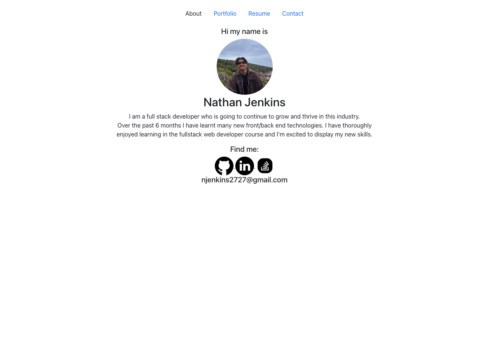

# nathan-react-portfolio

## Table of Content 
- [nathan-react-portfolio](#nathan-react-portfolio)
  - [Table of Content](#table-of-content)
  - [Description](#description)
  - [Installation](#installation)
  - [Usage](#usage)
  - [Deployed](#deployed)
  - [Questions](#questions)

## Description
This application is the my porfolio using react. React has been quite fun to learn and seems like in the future it will be useful in terms of speed as you can create smaller and more efficient files of code. The challenges I faced where the css portion, currently as of right now css has barely been touched on however this is something I am going to work on in the future. I used react for the many attribute it has to offer, such as: 
  - Usability 
  - Flexability 
  - Reausable components

## Installation
Clone the repo 
- `git clone`

Install the packages 
- `npm i`

Start the app 
- `npm run start dev`

## Usage
Navigate through the portfolio by clicking th tabs in the nav bar on top of the page, all icons you can click onto to take you to the desired page. 

## Deployed 

## Questions
If you want to contact me or have any questions you can visit my [Github](https://github.com/njenkins2727)
or if you have any further questions you can also send me an email: njenkins2727

